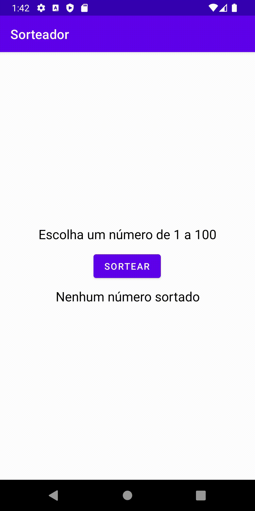

<h1 align="center">Sorteador</h1>

  
  
  
  

<!-- Status -->

<!-- <h4 align="center">
	🚧  Sorteador 🚀 Under construction...  🚧
</h4>

 -->

  <a href="#dart-about">About</a> &#xa0; | &#xa0;
  <a href="https://github.com/leticiafarias" target="_blank">Author</a>

 

 
  

## :dart: About
A aplicação desenvolvida trata-se de um sorteador simples que permite ao usuário sortear um número aleatório de 0 a 100 com o toque de um botão.

Made with :heart: by <a href="https://github.com/leticiafarias" target="_blank" >Letícia Farias</a>
